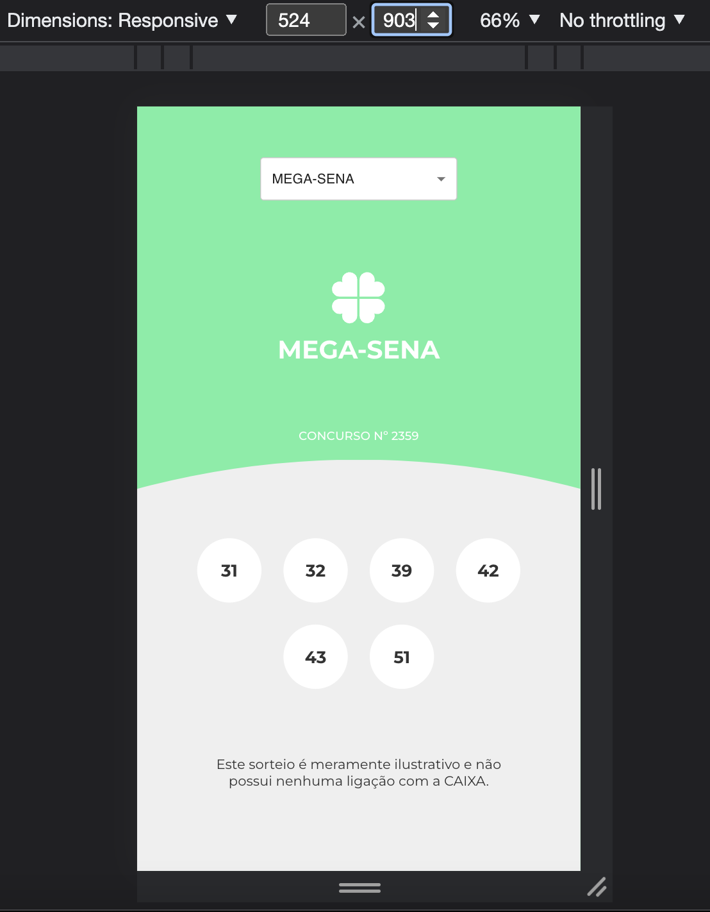
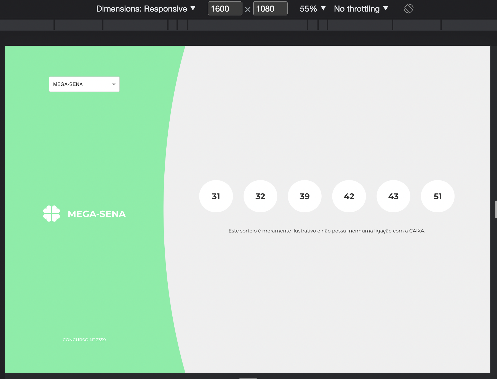

## Objetivo
Construir uma aplicação web front-end que mostre os Resultados das Loterias.
## Checklist :marca_de_verificação_branca:
- [x] A aplicação terá que suportar 6 sorteios: Mega-sena, Quina, Lotofácil, Lotomania, Timemania e Dia de Sorte.
- [x] Todos esses sorteios estarão em um combo-box/select.
- [x] Ao mudar esse combo-box, terá que mudar o tema do sorteio, número do sorteio, data do sorteio e números sorteados.
- [x] A aplicação terá que ser responsiva, pelo menos para celulares, conforme layout.
- [x] O consumo da API pode ser feito via REST ou GraphQL.
- [x] Criar rotas com React Router DOM (opcional).
- [+/-] Testes com React Testing Library e/ou Cypress.
- [ ] React com TypeScript.
## How to test :abanando:
1.  npm run test Concurso.test.js
## Screenshot :camera_flash:
Resoluções de telas seguindo o modelo do [Figma](https://www.figma.com/file/H2qrYBCFMf4didYmxRwTxP/Brainn-Frontend-Challenge?node-id=1%3A2)
### MOBILE :iphone: 524px x 903px

### DESKTOP :desktop_computer: 1600px x 1080px
